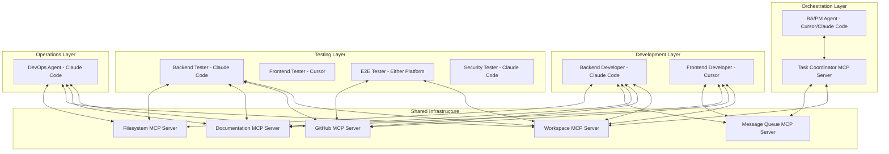
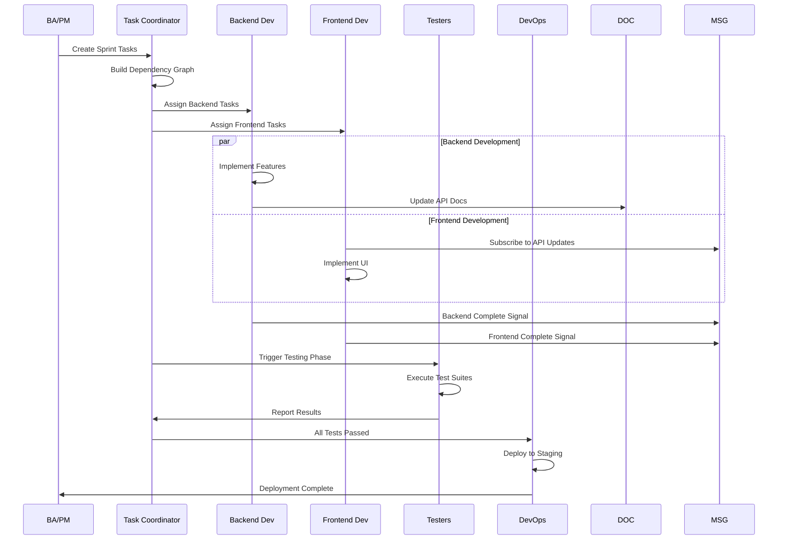

# Multi-Agent Development Team System Design Document
## Coordinated AI Coding Agents via Model Context Protocol (MCP)

**Version:** 2.0  
**Date:** January 2025  
**Status:** Updated - Supporting Multiple AI Platforms

## 2.3 Platform Selection Strategy

### Optimal Platform Assignments

| Agent Role | Recommended Platform | Rationale |
|### 3.5 Platform Coordination Bridge

**Purpose**: Handles platform-specific differences and enables seamless communication between Cursor and Claude Code instances.

**Key Features**:
- Protocol translation between platforms
- Worktree management for Claude Code instances
- Configuration synchronization
- Platform capability detection

**Implementation**:
```python
class PlatformCoordinationBridge:
    def __init__(self):
        self.cursor_instances = {}
        self.claude_code_instances = {}
        self.worktree_manager = GitWorktreeManager()
        
    async def launch_agent(self, agent_id, agent_type, platform):
        if platform == "claude_code":
            # Create isolated worktree for Claude Code
            worktree_path = await self.worktree_manager.create_worktree(
                branch=f"agent/{agent_id}",
                path=f"./workspaces/{agent_id}"
            )
            
            # Launch with platform-specific config
            config = self.generate_claude_code_config(agent_id, agent_type)
            return await self.launch_claude_code(worktree_path, config)
            
        elif platform == "cursor":
            # Launch Cursor with dedicated workspace
            config = self.generate_cursor_config(agent_id, agent_type)
            return await self.launch_cursor(config)
    
    def generate_claude_code_config(self, agent_id, agent_type):
        """Generate .mcp.json for Claude Code instance"""
        return {
            "mcpServers": {
                "task-coordinator": {
                    "type": "stdio",
                    "command": "node",
                    "args": ["./mcp-servers/task-coordinator/index.js"],
                    "env": {
                        "AGENT_ID": agent_id,
                        "AGENT_TYPE": agent_type,
                        "PLATFORM": "claude_code"
                    }
                },
                "filesystem": {
                    "type": "stdio",
                    "command": "npx",
                    "args": ["-y", "@modelcontextprotocol/server-filesystem", "./"]
                },
                # Include all standard servers
                **self.get_standard_mcp_servers()
            }
        }
```

------------|---------------------|-----------|
| BA/PM | Cursor | GUI for visual orchestration, easier monitoring |
| Backend Developer | Claude Code | Superior CLI integration, complex reasoning |
| Frontend Developer | Cursor | GUI needed for UI development |
| Backend Tester | Claude Code | CLI for automated testing, script execution |
| Frontend Tester | Cursor | Visual verification of UI components |
| E2E Tester | Either | Depends on test framework preference |
| Security Tester | Claude Code | CLI for security tools, penetration testing |
| DevOps | Claude Code | Native terminal operations, infrastructure scripts |

### Platform Capabilities Comparison

| Feature | Cursor | Claude Code |
|---------|--------|-------------|
| MCP Tools Support | ✅ Full | ✅ Full |
| MCP Resources | ❌ No | ✅ Yes |
| MCP Prompts | ❌ No | ✅ Yes |
| Configuration | GUI + JSON | CLI + 3-scope JSON |
| Tool Limit | 40 tools | Unlimited |
| Remote MCP | Limited | ✅ Full (SSE, HTTP) |
| Debugging | Visual indicators | `/mcp` command + logs |
| Multi-instance | Via separate windows | Git worktrees |
| Platform Support | Cross-platform | Windows (WSL), Mac, Linux |

---

## 1. Executive Summary

This document outlines the design for a multi-agent software development system that coordinates multiple AI coding agents (Cursor, Claude Code, Windsurf, etc.) acting as specialized developers. The system leverages the Model Context Protocol (MCP) for tool integration while implementing custom coordination layers for agent communication and workflow orchestration.

### Key Design Decisions
- **Platform-Agnostic Architecture**: Supports both Cursor and Claude Code as primary platforms, with extensibility for others
- **Hybrid Architecture**: Combines MCP's tool integration with custom coordination protocols
- **Shared MCP Server**: Central hub for task distribution and state management
- **Event-Driven Communication**: Asynchronous messaging through MCP resources
- **Git-Based Documentation**: Version-controlled knowledge base with immediate updates
- **Hierarchical Task Management**: BA/PM agent orchestrates specialized developer agents
- **Platform-Specific Optimizations**: Leverages each platform's unique strengths

---

## 2. System Architecture Overview

### 2.1 High-Level Architecture



### 2.2 Component Architecture

```
multi-agent-dev-team/
├── mcp-servers/
│   ├── task-coordinator/
│   ├── shared-workspace/
│   ├── documentation-hub/
│   └── message-queue/
├── agent-configs/
│   ├── ba-pm/
│   ├── backend-dev/
│   ├── frontend-dev/
│   └── ...
├── shared-resources/
│   ├── project-docs/
│   ├── api-contracts/
│   └── test-data/
└── orchestration/
    ├── workflow-engine/
    └── dependency-manager/
```

---

## 3. Core Components

### 3.1 Task Coordinator MCP Server

**Purpose**: Central orchestration hub managing task distribution and workflow coordination. Compatible with both Cursor and Claude Code clients.

**Capabilities**:
```json
{
  "tools": [
    {
      "name": "create_task",
      "description": "Create a new development task",
      "parameters": {
        "title": "string",
        "description": "string",
        "assignee": "string",
        "platform": "enum[cursor,claude_code,any]",
        "dependencies": "array",
        "priority": "number"
      }
    },
    {
      "name": "update_task_status",
      "description": "Update task progress",
      "parameters": {
        "task_id": "string",
        "status": "enum[pending,in_progress,blocked,review,complete]",
        "progress": "number",
        "notes": "string",
        "agent_platform": "string"
      }
    },
    {
      "name": "query_tasks",
      "description": "Query tasks by various criteria",
      "parameters": {
        "filter": "object",
        "sort": "string"
      }
    }
  ],
  "resources": [
    {
      "uri": "task://current-sprint",
      "description": "Current sprint backlog"
    },
    {
      "uri": "task://dependencies",
      "description": "Task dependency graph"
    },
    {
      "uri": "task://agent-status",
      "description": "Real-time agent platform status"
    }
  ],
  "prompts": [
    {
      "name": "task_breakdown",
      "description": "Break down high-level requirements into tasks"
    }
  ]
}
```

**Implementation**:
```python
class TaskCoordinatorServer:
    def __init__(self):
        self.tasks = {}
        self.dependencies = DependencyGraph()
        self.agent_assignments = {}
        self.platform_registry = {}  # Track agent platforms
        
    async def create_task(self, params):
        task = Task(**params)
        self.tasks[task.id] = task
        
        # Platform-aware assignment
        platform = params.get('platform', 'any')
        assignee = self.find_best_agent(params['assignee'], platform)
        
        # Notify assignee through message queue
        await self.message_queue.publish(
            channel=f"agent.{assignee}",
            message={
                "type": "task_assigned",
                "task_id": task.id,
                "priority": params['priority'],
                "platform_hint": platform
            }
        )
        
        # Update dependency graph
        for dep in params.get('dependencies', []):
            self.dependencies.add_edge(dep, task.id)
            
        return {"task_id": task.id, "assigned_to": assignee}
```

### 3.2 Shared Workspace MCP Server

**Purpose**: Provides coordinated access to the codebase with intelligent locking and merge capabilities.

**Features**:
- File-level locking with agent awareness
- Automatic merge conflict detection
- Change notification system
- Workspace snapshots for rollback

**Resources**:
```json
{
  "resources": [
    {
      "uri": "workspace://src/**/*",
      "description": "Source code files"
    },
    {
      "uri": "workspace://locks",
      "description": "Current file locks by agent"
    },
    {
      "uri": "workspace://changes",
      "description": "Recent change feed"
    }
  ]
}
```

### 3.3 Documentation Hub MCP Server

**Purpose**: Manages living documentation with version control and change notifications.

**Key Features**:
- Automatic documentation validation
- Change impact analysis
- Section-level subscriptions
- Documentation templates

**Implementation Approach**:
```python
class DocumentationHub:
    def __init__(self):
        self.documents = {}
        self.subscribers = defaultdict(list)
        self.change_history = []
        
    async def update_documentation(self, agent_id, doc_path, changes):
        # Validate changes against templates
        validation = self.validate_changes(doc_path, changes)
        if not validation.is_valid:
            return {"error": validation.errors}
            
        # Apply changes
        doc = self.documents[doc_path]
        doc.apply_changes(changes)
        
        # Notify subscribers
        affected_agents = self.get_affected_agents(doc_path, changes)
        for agent in affected_agents:
            await self.notify_agent(agent, {
                "type": "doc_updated",
                "path": doc_path,
                "sections": changes.sections,
                "author": agent_id
            })
            
        # Record in history
        self.change_history.append({
            "timestamp": datetime.now(),
            "agent": agent_id,
            "document": doc_path,
            "changes": changes
        })
```

### 3.4 Message Queue MCP Server

**Purpose**: Enables asynchronous communication between agents without direct connections.

**Communication Patterns**:
1. **Broadcast**: One agent to all agents
2. **Direct Message**: One agent to specific agent
3. **Channel-Based**: Topic-specific communications
4. **Request-Response**: Async Q&A with timeout support

**Message Schema**:
```typescript
interface AgentMessage {
  id: string;
  timestamp: Date;
  from: string;
  to: string | string[] | "all";
  type: MessageType;
  priority: Priority;
  thread_id?: string;
  payload: any;
  requires_response?: boolean;
  timeout?: number;
}

enum MessageType {
  STATUS_UPDATE = "status_update",
  QUESTION = "question",
  BLOCKER = "blocker",
  CODE_REVIEW_REQUEST = "code_review_request",
  DEPLOYMENT_NOTICE = "deployment_notice",
  DOCUMENTATION_UPDATE = "documentation_update"
}
```

---

## 4. Agent Specifications

### 4.1 Business Analyst / Project Manager Agent

**Role**: Orchestrates the entire development process, manages requirements, and ensures coordination.

**MCP Connections**:
- Task Coordinator (primary)
- Documentation Hub (read/write)
- Message Queue (all channels)
- GitHub (issue management)

**Responsibilities**:
```yaml
initialization:
  - Create system design document
  - Define implementation guide
  - Establish coding standards
  - Create initial task breakdown
  - Set up GitHub issues

runtime:
  - Monitor task progress
  - Resolve blockers
  - Adjust priorities
  - Review documentation updates
  - Coordinate releases
  - Generate status reports
```

**Configuration**:
```json
{
  "agent_type": "ba_pm",
  "capabilities": ["orchestration", "documentation", "planning"],
  "mcp_servers": {
    "task-coordinator": {
      "permissions": ["create", "update", "delete", "query"]
    },
    "documentation-hub": {
      "permissions": ["read", "write", "approve"]
    },
    "message-queue": {
      "channels": ["all"],
      "priority_override": true
    }
  }
}
```

### 4.2 Backend Developer Agent (Claude Code)

**Role**: Implements server-side logic, APIs, and database interactions using Claude Code's superior CLI capabilities.

**MCP Connections**:
- Shared Workspace (backend services)
- GitHub (code commits)
- Documentation Hub (API contracts)
- Message Queue (dev channels)
- Filesystem (full MCP resources support)

**Configuration** (`.mcp.json` in project scope):
```json
{
  "mcpServers": {
    "task-coordinator": {
      "type": "stdio",
      "command": "node",
      "args": ["./mcp-servers/task-coordinator/index.js"]
    },
    "github": {
      "type": "stdio",
      "command": "npx",
      "args": ["-y", "@modelcontextprotocol/server-github"],
      "env": {"GITHUB_TOKEN": "${GITHUB_TOKEN}"}
    },
    "filesystem": {
      "type": "stdio",
      "command": "npx",
      "args": ["-y", "@modelcontextprotocol/server-filesystem", "./backend"]
    },
    "postgresql": {
      "type": "stdio",
      "command": "npx",
      "args": ["-y", "@modelcontextprotocol/server-postgres"],
      "env": {"DATABASE_URL": "${DATABASE_URL}"}
    }
  }
}
```

**Key Behaviors**:
```python
class BackendDeveloperAgent:
    async def on_task_assigned(self, task):
        # Load relevant documentation
        docs = await self.doc_hub.get_relevant_docs(task)
        
        # Check dependencies
        deps = await self.task_coordinator.get_dependencies(task.id)
        if not all(dep.status == "complete" for dep in deps):
            await self.message_queue.publish({
                "type": "waiting_on_dependencies",
                "task_id": task.id,
                "blocking_tasks": [d.id for d in deps if d.status != "complete"]
            })
            return
            
        # Acquire workspace locks
        files_to_modify = self.analyze_task_scope(task)
        locks = await self.workspace.acquire_locks(files_to_modify)
        
        # Implement feature
        implementation = await self.implement_feature(task, docs)
        
        # Update documentation immediately
        doc_updates = self.generate_doc_updates(implementation)
        await self.doc_hub.update("api-contracts", doc_updates)
        
        # Create pull request
        pr = await self.github.create_pr(implementation, task)
        
        # Notify completion
        await self.task_coordinator.update_status(
            task.id, 
            "review",
            notes=f"PR: {pr.url}"
        )
```

### 4.3 Frontend Developer Agent (Cursor)

**Role**: Implements user interfaces and client-side logic using Cursor's GUI capabilities.

**MCP Connections**:
- Shared Workspace (frontend code)
- GitHub (code commits)
- Documentation Hub (API contracts, UI patterns)
- Message Queue (dev channels)
- Browser automation (for testing)

**Configuration** (`cursor_config.json`):
```json
{
  "mcpServers": {
    "task-coordinator": {
      "command": "node",
      "args": ["./mcp-servers/task-coordinator/index.js"],
      "env": {
        "AGENT_ID": "frontend_dev",
        "PLATFORM": "cursor"
      }
    },
    "github": {
      "command": "npx",
      "args": ["-y", "@modelcontextprotocol/server-github"]
    },
    "puppeteer": {
      "command": "npx",
      "args": ["-y", "@modelcontextprotocol/server-puppeteer"]
    }
  }
}
```

**Unique Features**:
- Subscribes to API contract changes
- Maintains UI component library documentation
- Coordinates with Backend on integration points

### 4.4 Testing Agents

**Shared Behaviors**:
- Wait for development completion signals
- Update test coverage documentation
- Report issues through blocker system

**Specializations**:
- **Backend Tester**: API testing, database integrity
- **Frontend Tester**: Component testing, accessibility
- **E2E Tester**: User journey validation
- **Security Tester**: Vulnerability scanning, penetration testing

### 4.5 DevOps Agent (Claude Code)

**Role**: Manages deployment pipelines and infrastructure using CLI tools.

**MCP Configuration**:
```json
{
  "mcpServers": {
    "task-coordinator": {
      "type": "stdio",
      "command": "node",
      "args": ["./mcp-servers/task-coordinator/index.js"]
    },
    "aws": {
      "type": "stdio",
      "command": "npx",
      "args": ["-y", "@aws/mcp-server-aws"],
      "env": {"AWS_PROFILE": "production"}
    },
    "kubernetes": {
      "type": "sse",
      "url": "https://k8s-mcp.company.com",
      "headers": {"Authorization": "Bearer ${K8S_TOKEN}"}
    }
  }
}
```

**Special Permissions**:
- Production environment access
- Infrastructure configuration
- Deployment triggers

---

## 5. Workflow Orchestration

### 5.1 Sprint Workflow



### 5.2 Coordination Patterns

**1. Dependency Management**
```python
class DependencyManager:
    def __init__(self):
        self.graph = nx.DiGraph()
        self.blocked_agents = {}
        
    async def check_can_proceed(self, task_id):
        dependencies = list(self.graph.predecessors(task_id))
        
        for dep in dependencies:
            dep_status = await self.get_task_status(dep)
            if dep_status != "complete":
                return False, dep
                
        return True, None
        
    async def notify_unblocked(self, completed_task):
        dependents = list(self.graph.successors(completed_task))
        
        for task in dependents:
            can_proceed, _ = await self.check_can_proceed(task)
            if can_proceed:
                assignee = await self.get_task_assignee(task)
                await self.message_queue.notify(
                    assignee,
                    {"type": "unblocked", "task_id": task}
                )
```

**2. Conflict Resolution**
```python
class ConflictResolver:
    async def handle_workspace_conflict(self, agent1, agent2, file):
        # Determine priority
        task1 = await self.get_agent_current_task(agent1)
        task2 = await self.get_agent_current_task(agent2)
        
        if task1.priority > task2.priority:
            winner, waiter = agent1, agent2
        else:
            winner, waiter = agent2, agent1
            
        # Notify agents
        await self.notify_agent(winner, {
            "type": "conflict_resolved",
            "file": file,
            "status": "proceed"
        })
        
        await self.notify_agent(waiter, {
            "type": "conflict_resolved", 
            "file": file,
            "status": "wait",
            "retry_after": 300  # 5 minutes
        })
```

---

## 6. Communication Protocols

### 6.1 Message Flows

**Platform-Aware Status Update Flow**:
```
Agent → Message Queue → Subscribers
                     ↓
              Task Coordinator
                     ↓
         Platform Capability Check
                     ↓
               Update Dashboard
```

**Cross-Platform Question-Answer Flow**:
```
Frontend Dev (Cursor) → Message Queue → Backend Dev (Claude Code)
                                    ↓
                            Process Question
                                    ↓
                   Message Queue ← Response with Platform Context
                            ↓
                    Frontend Dev (Cursor)
```

### 6.2 Channel Structure

```yaml
channels:
  standup:
    description: "Daily status updates"
    subscribers: ["all"]
    retention: "7 days"
    
  blockers:
    description: "Urgent impediments"
    subscribers: ["all"]
    priority: "high"
    escalation: "ba_pm"
    
  code-review:
    description: "PR discussions"
    subscribers: ["developers", "testers"]
    platform_aware: true  # Include platform in review context
    
  api-changes:
    description: "API contract updates"
    subscribers: ["frontend_dev", "testers"]
    
  deployment:
    description: "Release coordination"
    subscribers: ["devops", "ba_pm", "testers"]
    
  platform-sync:
    description: "Platform-specific coordination"
    subscribers: ["all"]
    purpose: "Sync between Cursor and Claude Code instances"
```

---

## 7. Documentation Management

### 7.1 Documentation Structure

```
project-docs/
├── architecture/
│   ├── system-design.md          # Living document
│   ├── api-contracts/            # OpenAPI specs
│   └── database-schema.md        # ERD and migrations
├── implementation/
│   ├── coding-standards.md       # Team conventions
│   ├── git-workflow.md           # Branching strategy
│   └── deployment-guide.md       # CI/CD processes
├── testing/
│   ├── test-strategy.md          # Testing approach
│   ├── test-cases/               # Scenario library
│   └── coverage-reports/         # Auto-generated
└── operations/
    ├── runbooks/                 # Operational procedures
    ├── monitoring.md             # Alerts and dashboards
    └── incident-response.md      # Emergency procedures
```

### 7.2 Update Protocol

```python
class DocumentationUpdateProtocol:
    async def on_task_complete(self, agent, task, implementation):
        # Generate documentation updates
        updates = agent.analyze_implementation_vs_docs(
            implementation,
            self.get_related_docs(task)
        )
        
        # Create documentation PR
        doc_pr = await self.create_doc_pr(updates, task)
        
        # Notify affected agents
        affected = self.analyze_doc_impact(updates)
        for agent_id in affected:
            await self.notify_documentation_change(
                agent_id,
                updates,
                urgency=self.calculate_urgency(agent_id, updates)
            )
```

---

## 8. Implementation Plan

### 8.1 Phase 1: Core Infrastructure (Week 1-2)
- [ ] Implement Task Coordinator MCP Server
- [ ] Set up Shared Workspace Server
- [ ] Create Message Queue Server
- [ ] Develop base agent framework

### 8.2 Phase 2: Essential Agents (Week 3-4)
- [ ] BA/PM Agent with orchestration capabilities
- [ ] Backend Developer Agent
- [ ] Frontend Developer Agent
- [ ] Basic DevOps Agent

### 8.3 Phase 3: Testing Suite (Week 5-6)
- [ ] Backend Tester Agent
- [ ] Frontend Tester Agent
- [ ] E2E Tester Agent
- [ ] Testing coordination protocols

### 8.4 Phase 4: Advanced Features (Week 7-8)
- [ ] Security Tester Agent
- [ ] Advanced conflict resolution
- [ ] Performance optimization
- [ ] Monitoring and analytics

---

## 9. Configuration Examples

### 9.1 Cursor Configuration

```json
{
  "mcpServers": {
    "task-coordinator": {
      "command": "node",
      "args": ["./mcp-servers/task-coordinator/index.js"],
      "env": {
        "AGENT_ID": "${AGENT_ID}",
        "AGENT_TYPE": "${AGENT_TYPE}",
        "PLATFORM": "cursor"
      }
    },
    "shared-workspace": {
      "command": "python",
      "args": ["-m", "mcp_servers.shared_workspace"],
      "env": {
        "WORKSPACE_ROOT": "./codebase",
        "LOCK_TIMEOUT": "300"
      }
    },
    "github": {
      "command": "npx",
      "args": ["-y", "@modelcontextprotocol/server-github"],
      "env": {
        "GITHUB_TOKEN": "${GITHUB_TOKEN}"
      }
    }
  }
}
```

### 9.2 Claude Code Configuration

**Project-scoped `.mcp.json`**:
```json
{
  "mcpServers": {
    "task-coordinator": {
      "type": "stdio",
      "command": "node",
      "args": ["./mcp-servers/task-coordinator/index.js"],
      "env": {
        "AGENT_ID": "${AGENT_ID}",
        "AGENT_TYPE": "${AGENT_TYPE}",
        "PLATFORM": "claude_code"
      }
    },
    "filesystem": {
      "type": "stdio",
      "command": "npx",
      "args": ["-y", "@modelcontextprotocol/server-filesystem", "./"],
      "env": {}
    },
    "github": {
      "type": "stdio",
      "command": "npx",
      "args": ["-y", "@modelcontextprotocol/server-github"],
      "env": {"GITHUB_TOKEN": "${GITHUB_TOKEN}"}
    },
    "message-queue": {
      "type": "sse",
      "url": "https://mcp-queue.company.com",
      "headers": {"Authorization": "Bearer ${MCP_TOKEN}"}
    }
  }
}
```

**CLI Setup for Claude Code**:
```bash
# Add MCP servers using Claude Code CLI
claude mcp add task-coordinator node ./mcp-servers/task-coordinator/index.js
claude mcp add --transport sse message-queue https://mcp-queue.company.com
claude mcp add github -e GITHUB_TOKEN=$GITHUB_TOKEN -- npx -y @modelcontextprotocol/server-github
```

### 9.3 Agent Launch Script (Updated)

```bash
#!/bin/bash
# launch-agent.sh - Platform-aware agent launcher

AGENT_TYPE=$1
PLATFORM=${2:-"auto"}  # Default to auto-selection
AGENT_ID="${AGENT_TYPE}_$(date +%s)"

export AGENT_ID
export AGENT_TYPE

# Auto-select platform based on agent type
if [ "$PLATFORM" = "auto" ]; then
    case $AGENT_TYPE in
        "backend_dev"|"backend_tester"|"security_tester"|"devops")
            PLATFORM="claude_code"
            ;;
        "frontend_dev"|"frontend_tester"|"ba_pm")
            PLATFORM="cursor"
            ;;
        *)
            PLATFORM="claude_code"  # Default
            ;;
    esac
fi

if [ "$PLATFORM" = "claude_code" ]; then
    # Create worktree for Claude Code instance
    git worktree add -b "agent/$AGENT_ID" "./workspaces/$AGENT_ID"
    cd "./workspaces/$AGENT_ID"
    
    # Copy project-scoped MCP config
    cp ../../.mcp.json .
    
    # Launch Claude Code
    claude code --project-dir . --agent-id "$AGENT_ID"
    
elif [ "$PLATFORM" = "cursor" ]; then
    # Copy and customize Cursor config
    cp configs/cursor-base.json "configs/cursor-${AGENT_ID}.json"
    
    # Inject agent-specific configuration
    jq ".agent = {\"id\": \"${AGENT_ID}\", \"type\": \"${AGENT_TYPE}\"}" \
      "configs/cursor-${AGENT_ID}.json" > tmp.json && \
      mv tmp.json "configs/cursor-${AGENT_ID}.json"
    
    # Launch Cursor with specific config
    cursor --config "./configs/cursor-${AGENT_ID}.json" \
           --workspace "./workspaces/${AGENT_TYPE}"
fi
```

### 9.4 Multi-Platform Team Launch

```bash
#!/bin/bash
# launch-team.sh - Launch complete multi-agent team

echo "Launching multi-platform development team..."

# Launch orchestrator (Cursor for visual monitoring)
./launch-agent.sh ba_pm cursor &

# Launch backend team (Claude Code for CLI power)
./launch-agent.sh backend_dev claude_code &
./launch-agent.sh backend_tester claude_code &

# Launch frontend team (Cursor for GUI development)
./launch-agent.sh frontend_dev cursor &
./launch-agent.sh frontend_tester cursor &

# Launch specialized agents
./launch-agent.sh security_tester claude_code &
./launch-agent.sh devops claude_code &

echo "All agents launched. Check ./logs/ for individual agent logs."
```

---

## 10. Monitoring and Observability

### 10.1 Metrics to Track

```yaml
task_metrics:
  - tasks_completed_per_agent
  - average_task_duration
  - blocker_frequency
  - rework_rate

communication_metrics:
  - messages_per_channel
  - response_time_by_type
  - unanswered_questions

quality_metrics:
  - test_coverage
  - bug_escape_rate
  - documentation_completeness
  - pr_rejection_rate

system_metrics:
  - agent_uptime
  - mcp_server_latency
  - workspace_conflicts
  - resource_utilization
```

### 10.2 Dashboard Design

```python
class AgentDashboard:
    def __init__(self):
        self.metrics = MetricsCollector()
        
    def get_team_status(self):
        return {
            "agents": self.get_agent_statuses(),
            "sprint_progress": self.calculate_sprint_progress(),
            "blockers": self.get_active_blockers(),
            "recent_deployments": self.get_deployment_history(),
            "quality_indicators": self.get_quality_metrics()
        }
```

---

## 11. Security Considerations

### 11.1 Access Control
- Agent-specific permissions for MCP servers
- Role-based access to sensitive operations
- Audit logging for all actions
- Platform-specific security contexts

### 11.2 Data Protection
- Encrypted message queue communications
- Secure credential management
- Isolated agent workspaces (especially for Claude Code worktrees)
- MCP server sandboxing (critical for Claude Code's unlimited tool access)

### 11.3 Platform-Specific Security

**Claude Code Considerations**:
- MCP servers run with full user privileges
- No built-in sandboxing - implement container isolation
- Careful vetting of community MCP servers
- Use local scope for sensitive configurations

**Cursor Considerations**:
- 40-tool limit provides some protection
- GUI makes it easier to monitor activity
- Limited to tools (no resources/prompts access)

---

## 12. Future Enhancements

### 12.1 Advanced Capabilities
- Machine learning for task estimation
- Automatic code review suggestions
- Predictive blocker detection
- Dynamic agent scaling
- Cross-platform performance optimization

### 12.2 Integration Opportunities
- Integration with existing CI/CD pipelines
- Connection to project management tools
- Real-time client notifications
- Advanced analytics and reporting
- Leverage upcoming MCP enhancements (2025 roadmap)

### 12.3 Platform Evolution Readiness
- **MCP Protocol Updates**: Both platforms actively developing
- **Enhanced Authentication**: Coming in 2025
- **Interactive Workflows**: Better human-in-the-loop support
- **Multi-modal Support**: Beyond text-based interactions

---

## 13. Platform-Specific Best Practices

### 13.1 Claude Code Best Practices
- Use Git worktrees for parallel instances
- Leverage three-scope configuration hierarchy
- Implement robust error handling for 600-second timeouts
- Monitor for "response interrupted" errors
- Use `/mcp` command for debugging

### 13.2 Cursor Best Practices
- Keep within 40-tool limit
- Use visual indicators for monitoring
- Leverage GUI for complex configurations
- Implement fallbacks for missing resources/prompts

### 13.3 Mixed Platform Coordination
- Use file-based communication for critical updates
- Implement platform capability detection
- Maintain platform-agnostic task definitions
- Regular synchronization checkpoints

---

## 14. Conclusion

This system design provides a robust foundation for coordinating multiple AI coding agents as a unified development team. By supporting both Cursor and Claude Code, we leverage each platform's unique strengths while maintaining a cohesive workflow through MCP.

Key advantages of the multi-platform approach:
- **Best Tool for Each Task**: Claude Code for CLI/backend, Cursor for GUI/frontend
- **Platform Redundancy**: Not dependent on a single AI coding platform
- **Enhanced Capabilities**: Full MCP protocol support through Claude Code
- **Flexible Scaling**: Add agents on either platform as needed

The architecture is designed to be:
- **Platform-Agnostic**: Core infrastructure works with any MCP-compatible client
- **Scalable**: Easy to add new agent types and platforms
- **Resilient**: Handles platform-specific failures gracefully
- **Observable**: Comprehensive monitoring across platforms
- **Maintainable**: Clear separation of concerns and platform abstractions

Success depends on:
1. Careful platform selection for each agent role
2. Robust coordination protocols that work across platforms
3. Comprehensive error handling for platform-specific issues
4. Continuous refinement based on operational experience
5. Staying current with platform updates and MCP evolution

This design positions the system to take advantage of the rapidly evolving AI coding assistant ecosystem while maintaining stability and reliability for production development workflows.